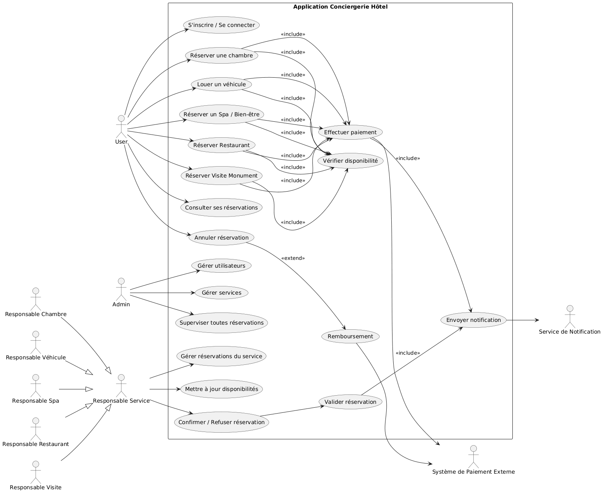

#  Entités

## User
- id
- first_name
- last_name
- email
- phone
- address
- password
- role
- avatar
# Relations:
# - User 1 --- * Reservation (one-to-many)
# - User 1 --- * Message (as sender/receiver) (one-to-many)
# - User 1 --- * Notification (one-to-many)
# - User * --- * Partner (many-to-many, via UserFavoritePartner)

## UserFavoritePartner
- user_id
- partner_id
# Relations:
# - user_id references User
# - partner_id references Partner

## Service
- id
- name
- category
- description
- address
- availability
- link
# Relations:
# - Service * --- * Partner (many-to-many)
# - Service 1 --- * Reservation (one-to-many)

## Reservation
- id
- user_id
- service_id
- reservation_date
- status
# Relations:
# - Reservation * --- 1 User (many-to-one)
# - Reservation * --- 1 Service (many-to-one)

## Message
- id
- sender_id
- receiver_id
- content
- createdAt
# Relations:
# - Message * --- 1 User (as sender) (many-to-one)
# - Message * --- 1 User (as receiver) (many-to-one)

## Partner
- id
- name
- address
- phone
- offered_services
- user_id
# Relations:
# - Partner * --- * Service (many-to-many)

## Notification
- id
- user_id
- content
- createdAt
# Relations:
# - Notification * --- 1 User (many-to-one)

